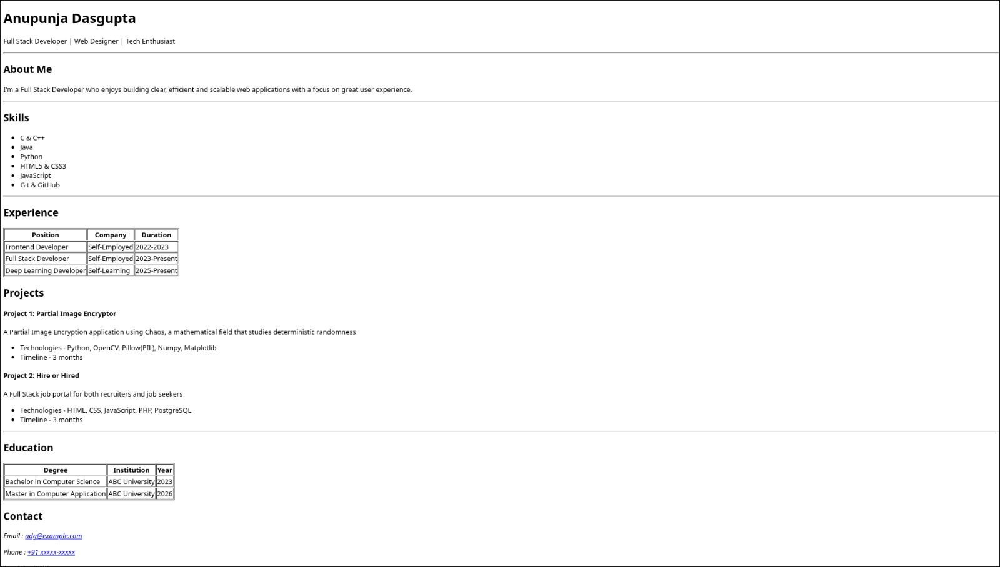

# Personal Portfolio Website

A simple, clean, and semantic **HTML5 portfolio website** showcasing my skills, experience, projects, and education as a Full Stack Developer.

---

## Demo

## Screenshot

  

---

## About Me

Hi, I’m **Anupunja Dasgupta** — a Full Stack Developer and Web Designer passionate about building efficient, scalable, and user-friendly web applications with a strong focus on clean UI and semantic HTML.

---

## Skills

- C & C++
- Java
- Python
- HTML5 & CSS3
- JavaScript
- Git & GitHub

---

## Experience

| Position                | Company        | Duration        |
|-------------------------|----------------|-----------------|
| Frontend Developer      | Self-Employed  | 2022 – 2023     |
| Full Stack Developer    | Self-Employed  | 2023 – Present  |
| Deep Learning Developer | Self-Learning  | 2025 – Present  |

---

## Projects

### Partial Image Encryptor
A partial image encryption application based on chaos theory, which studies deterministic randomness.

Technologies:  
Python, OpenCV, Pillow (PIL), NumPy, Matplotlib  

Timeline: 3 months

---

### Hire or Hired
A full-stack job portal designed for both recruiters and job seekers.

Technologies:  
HTML, CSS, JavaScript, PHP, PostgreSQL  

Timeline: 3 months

---

## Education

| Degree                         | Institution     | Year |
|-------------------------------|-----------------|------|
| Bachelor in Computer Science  | ABC University  | 2023 |
| Master in Computer Application| ABC University  | 2026 |

---
